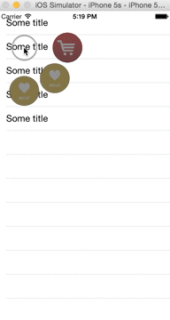

[](https://github.com/Carthage/Carthage)

# GNAContextMenu

Long press context menu (like in Pintrest for iOS app)

## Requirements

- iOS 9.0+
- Xcode 8.0+

## Installation
 
The easiest way is through [CocoaPods](http://cocoapods.org). Simply add the dependency to your `Podfile` and then `pod install`:
 
 ```ruby
 pod `GNAContextMenu`
 ```
 
Or [Carthage](https://github.com/Carthage/Carthage). Add the depdency to your `Cartfile` and then `carthage update`:

```ogdl
github "gridNA/GNAContextMenu"
```

## How

```swift
import GNAContextMenu
```
1) add on view in `UIViewController`, where you plan to use context menu
 
```swift 
UILongPressGestureRecognizer
```

2) create GNAMenuView and set delegate 

```swift
var menuView = GNAMenuView(menuItems: 
              [GNAMenuItem(icon: UIImage(named: "shopingCart_inactive"), 
                           activeIcon: UIImage(named: "shopingCart"), 
                           title: "Shop it"), 
              GNAMenuItem(icon: UIImage(named: "wishlist_inacitve"), 
                          activeIcon: UIImage(named: "wishlist"), 
                          title: "Wish")])
menuView.delegate = self
```
3) on long press 

```swift 
 menuView.handleGesture(gesture, inView: yourView)
 ```

You can also implement GNAMenuItemDelegate methods:

```swift
  menuItemWasPressed(menuItem: GNAMenuItem, info: [String: AnyObject]?)
  menuItemActivated(menuItem: GNAMenuItem, info: [String: AnyObject]?)
  menuItemDeactivated(menuItem: GNAMenuItem, info: [String: AnyObject]?)
```
Please see example for more info.

## Example


